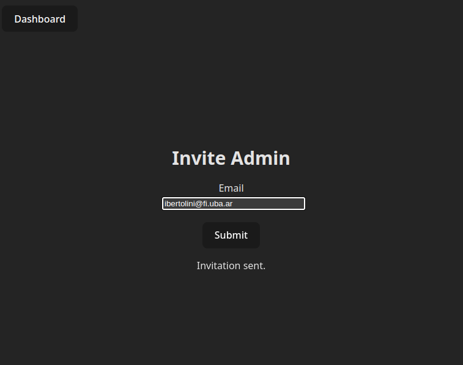
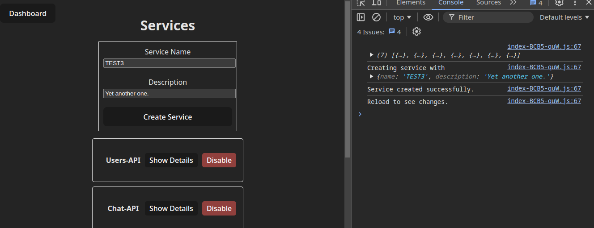

# Manual Backoffice

## Introducción

En este manual solo se harán breves explicaciones de algunas funcionalidades.
Debido a la simpleza de la aplicación, se considerá innecesario hacer un manual muy extenso.

## Registro

Para registrarse como administrador en el backoffice, es necesario recibir una invitación
de un administrador ya existente.

Para esto, una vez logueado como administrador,
desde el **Dashboard**, ir a la sección de **Invite**.
Al introducir el mail del nuevo administrador y enviar la invitación, de ser
exitosa, se mostrará un mensaje de confirmación y le llegará un token al correo electrónico ingresado.

Si ya hay una cuenta con este email, no se enviará el token y se recibirá un mensaje de error 
con codigo 409 desde el servidor.

Con este token puede proceder al formulario de registro e introducir el token
en el campo correspondiente. Solamente se podrá registrar con el mail al que le fue enviado el token.

## Baneos, Bloqueos y Deshabilitaciones

Tanto en las secciones de **Users**, **Snaps** y **Services** hay opciones para cambiar el estado de los mismos:
* Banear/Desbanear Usuarios:
Se le prohibe al usuario acceder a la plataforma. Tambien deja de aparecer en la aplicación.
* Bloquear/Desbloquear Snaps:
Se deja de mostrar el snap en la aplicación.
* Deshabilitar/Habilitar Servicios:
Se invalidan las API calls que el servicio haga internamente.

Al utilizar una de estas funciones, de ser exitosa, se mostrará un log en consola y se cambiará el
color y el texto del boton en cuestión. En caso contrario, significa que la acción no pudo completarse.

## Crear Servicios

Para crear servicios, utilizar el formulario en la parte superior de la seccion **Services**.
Se debe ingresar un nombre y una descripción. De ser exitosa la operación,
se mostrará un log por consola y se indicará que es necesario refrescar la página para ver los cambios.

## Arquitectura Backoffice

