<!-- START doctoc generated TOC please keep comment here to allow auto update -->
<!-- DON'T EDIT THIS SECTION, INSTEAD RE-RUN doctoc TO UPDATE -->

## **Manual de Usuario \- Aplicación Twitsnap**

- [**Manual de Usuario - Aplicación Twitsnap**](#manual-de-usuario---aplicación-twitsnap)
- [**1. Introducción**](#1-introducción)
- [**2. Registro de usuario**](#2-registro-de-usuario)
  - [**Registro normal**](#registro-normal)
  - [**Entrar con Google**](#entrar-con-google)
- [**3. Inicio de sesión y logout**](#3-inicio-de-sesión-y-logout)
  - [**Inicio de sesión normal**](#inicio-de-sesión-normal)
  - [**Inicio de sesión con Google**](#inicio-de-sesión-con-google)
- [**4. Feed y como publicar un twit**](#4-feed-y-como-publicar-un-twit)
  - [**Feed**](#feed)
  - [**Publicar**](#publicar)
- [**5. Detalles de un Tuit**](#5-detalles-de-un-tuit)
- [**6. Perfiles**](#6-perfiles)
- [**7. Buscar Usuarios/Twits**](#7-buscar-usuariostwits)
- [**8. Chats**](#8-chats)
- [**9. Notificaciones**](#9-notificaciones)
  - [**Activación de Notificaciones**](#activación-de-notificaciones)
  - [**Visualización de Notificaciones**](#visualización-de-notificaciones)
- [**10. Recupero de contraseña**](#10-recupero-de-contraseña)

<!-- END doctoc generated TOC please keep comment here to allow auto update -->

## **1. Introducción**

Bienvenido al manual de usuario de nuestra aplicación Twitsnap. Este documento te guiará a través de las funcionalidades principales de la aplicación, desde el registro hasta la publicación de contenido

## **2. Registro de usuario**

### **Registro normal**

1. Abre la aplicación y selecciona la opción **Registrarse**.  
2. Completa el formulario de registro proporcionando:  
   - Nombre de usuario  
   - Correo electrónico  
   - Número de teléfono (opcional)  
   - País  
   - Intereses (opcional)  
   - Contraseña  
3. Acepta los términos y condiciones y haz clic en **Registrar**.  
4. Recibirás un correo electrónico de confirmación. La cual no servirá para verificar la cuenta cuando hagamos el login.

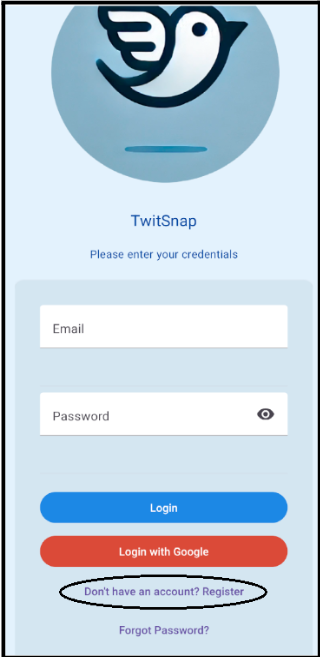 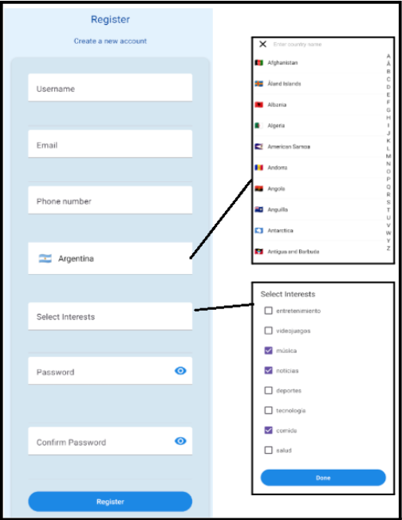

### **Entrar con Google**

1. Abre la aplicación y selecciona la opción **Login with Google**.  
2. Inicia sesión en tu cuenta de Google si aún no lo has hecho.  
3. Autoriza el acceso de la aplicación a tu cuenta de Google.  
4. La aplicación usará tu información de Google (nombre, correo electrónico) para completar el registro automáticamente.

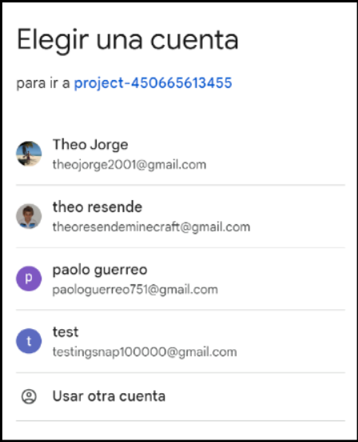 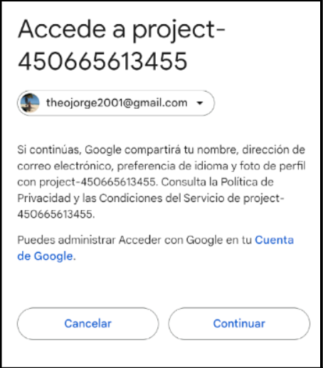

## **3. Inicio de sesión y logout**

### **Inicio de sesión normal**

1. Ingresa tu correo electrónico y contraseña registrados.  
2. En la pantalla de inicio, selecciona la opción **Login**.  
3. Verificación de PIN (Primera Vez o Cuenta No Verificada):  

- Si es la primera vez que ingresas o si aún no verificaste tu cuenta, se enviará un PIN de verificación al correo electrónico que utilizaste al registrarte.  
- Ingresa el PIN en la pantalla correspondiente para completar el acceso.  
- Si no encuentras el correo o el PIN ha expirado, selecciona la opción **"Reenviar PIN"** para recibir un nuevo código.

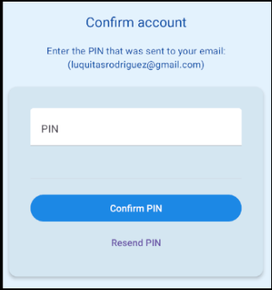 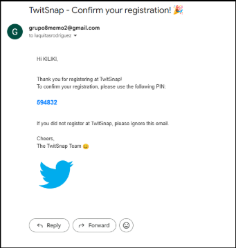

### **Inicio de sesión con Google**

1. En la pantalla de inicio, selecciona la opción **Login with Google**.  
2. Si ya has registrado tu cuenta usando Google, solo necesitarás iniciar sesión en tu cuenta de Google.  
3. Autoriza el acceso si es necesario y accederás a tu cuenta.

***Nota: Si te registraste con Google, el inicio de sesión deberá realizarse también con Google. No necesitarás crear una contraseña adicional.***

**Logout**

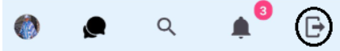

1. Para cerrar sesión, selecciona la opción **"Cerrar Sesión"** desde el menú principal.  
2. Esto desconectará tu cuenta de forma segura, protegiendo tu información.

## **4. Feed y como publicar un twit**

### **Feed**

El feed de la aplicación presenta una lista de publicaciones organizadas cronológicamente y personalizadas según tus intereses. En esta sección encontrarás:

- **Feed General**: Una vista general de las publicaciones más recientes y relevantes.  
- **Trending Topics**: Una lista de los tags más populares en el momento. Al seleccionar un trending topic, podrás ver el feed asociado con ese tag.  
- **Botón de Recarga**: Un botón para actualizar el feed y asegurarte de estar viendo el contenido más reciente.

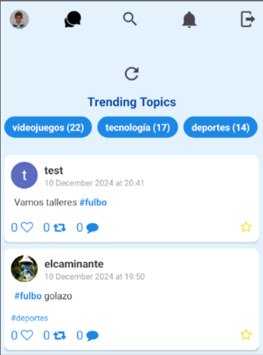

### **Publicar**

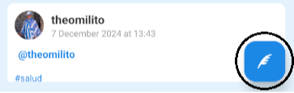

En la parte inferior derecha del feed, encontrarás un botón flotante que te permitirá acceder rápidamente a la pantalla de publicación.

Puedes crear tus propias publicaciones con las siguientes características:

- **Seleccionar Intereses (Tags)**: Puedes agregar intereses relacionados a tu publicación para alcanzar a una audiencia específica.  
- **Mencionar Usuarios**: Es posible etiquetar a otros usuarios utilizando el símbolo `@` seguido del nombre de usuario.  
- **Hashtags**: Incluye hashtags relevantes utilizando el símbolo `#` para facilitar que otros encuentren tu publicación.  
- **Privacidad**: Tienes la opción de configurar tu publicación como privada, para que solo sea visible para tus seguidores.  
- **Publicar Botón**: Una vez que tu contenido esté listo, presiona el botón **Post Twit** para publicarlo.

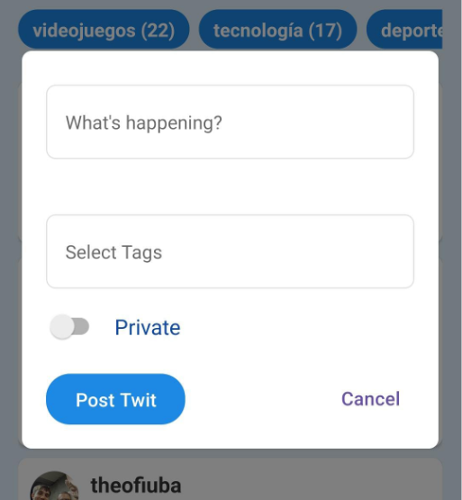

## **5. Detalles de un Tuit**

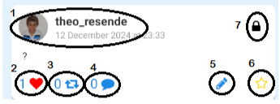

Cuando accedes a un twit específico, puedes interactuar con él mediante varias opciones y obtener información detallada. Las funcionalidades principales son:

**1.Perfil del Usuario**: Al hacer clic en el nombre o la foto del usuario que publicó el twit, podrás acceder a su perfil.

**2\. Like**: Pulsa el botón de corazón para indicar que te gusta el twit.

**3\. Retuit**: Comparte el twit de otro usuario en tu propio feed.

**4\. Comentar**: Utilizando la opción de comentar te lleva a la parte de comentarios de ese twit donde uno puede acceder a los comentarios y encima comentar (sin la posibilidad de usar tags o ponerlo en privado)

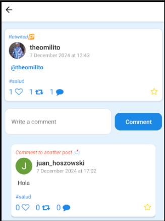

**5\. Editar/Eliminar**: Si el twit es mio aparecerá una opción que permite editarlo, pudiendo cambiar el mensaje, los tags y con la posibilidad de eliminar el twit directamente.

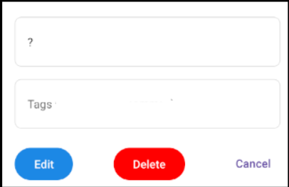

**6\. Favorito**: Marca el twit como favorito para guardarlo y revisarlo más tarde.

**7\. Privacidad**: Si el twit es privado, aparecerá una etiqueta indicando que solo los seguidores del usuario pueden verlo.

## **6. Perfiles**

**Perfil de Otro Usuario:** Al acceder al perfil de otro usuario, podrás ver su foto de perfil, nombre de usuario (username), biografía, y sus publicaciones.

    <image style= "width=100px; height:500px;" src="./images/perfil1.png"/>
    

    
<strong>1. Foto, Nombre de Usuario y Biografía</strong>: Verás su foto de perfil sumado a la bandera de su país, nombre de usuario (username) y la biografía que ha compartido, en la que puede describir detalles sobre sí mismo.
    

    
<strong>2. Seguidores y Seguidos</strong>: Solo podrás ver a quién sigue el usuario y quién lo sigue si te sigue también. Esto está sujeto a la configuración de privacidad del usuario. Además abajo vas a tener la opción de seguirlo o dejar de seguirlo.

    <image style= "width=100px; height:200px;" src="./images/seguidos.png"/>
    

    

        <strong>3. Favoritos</strong>: Podrás consultar las publicaciones   que el usuario ha marcado como favoritas.
    

  <image style= "width=100px; height:200px;" src="./images/favoritos.png">

**4\. Chat:** Podrás iniciar un chat con el usuario o acceder a él si ya está comenzado.

**5\. Feed del Perfil**: Observa todas tus publicaciones en un formato organizado y fácilmente navegable.

**Mi Perfil**

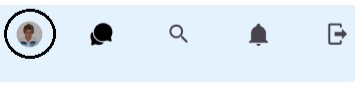

En la sección de Mi Perfil  la cual es accesible en la barra principal del menú donde está el feed general, además de las opciones disponibles en el perfil de otro usuario, tendrás herramientas adicionales para administrar y personalizar tu experiencia. Las funcionalidades principales incluyen:

    <image style= "width=100px; height:400px;" src="./images/perfil3.png">
    

    
<strong>1. Estadísticas</strong>: Consulta métricas detalladas sobre tu actividad en la aplicación, como el número de publicaciones realizadas, likes/retwits/comentarios recibidos, y seguidores ganados.
    

    

    <image style= "width=100px; height:200px;" src="./images/estadisticas1.png"/>
        <image style= "width=100px; height:200px;" src="./images/estadisticas2.png"/>
    

    

**2\. Mis Intereses**: Muestra nuestros intereses

**3\. Editar Perfil**: Modifica tu foto de perfil, biografía, nombre de usuario, país, y los intereses en cualquier momento.

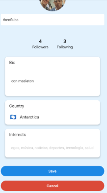

## **7. Buscar Usuarios/Twits**

La funcionalidad de búsqueda te permite encontrar usuarios y publicaciones relevantes mediante una interfaz sencilla e intuitiva. A continuación, se detalla cómo usar esta función:

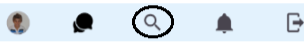

1. **Usuarios Recomendados**:  
   - Antes de realizar una búsqueda, se mostrará una lista de usuarios recomendados basada en tus intereses.  
   - Puedes eliminar cualquier usuario de la lista para que se muestren nuevas recomendaciones.  
2. **Búsqueda por Nombre de Usuario**:  
   - Introduce el username del usuario que deseas encontrar.  
   - Aparecerá una lista de usuarios coincidentes. Puedes seleccionar cualquier usuario para acceder a su perfil.  
3. **Botón "Search Twits"**:  
   - Al presionar este botón, se activará la búsqueda exclusiva de publicaciones que coincidan con tus términos.

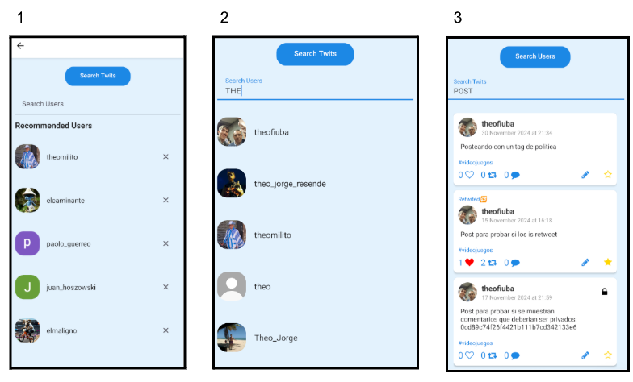

Con esta herramienta, podrás descubrir nuevos contenidos y usuarios de manera eficiente y organizada.

## **8. Chats**

La funcionalidad de chats te permite comunicarte en tiempo real con otros usuarios. En la barra de navegación principal, selecciona el icono de chats para acceder a la pantalla principal de mensajes. A continuación, se detalla cómo funciona:

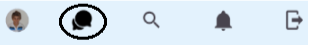

    

        

            <strong>1. Chats Activos</strong>:
                <ul>
                    <li>
                        Verás una lista de chats ya iniciados con   otros usuarios.
                    </li>
                    <li>
                        Selecciona cualquier chat para continuar la  conversación en tiempo real.
                    </li>
                <ul>
        

        

            <strong>2.Envío de Mensajes</strong>:
            <ul>
                <li>Dentro del chat, escribe tu mensaje en elcampo     de  texto y presiona el botón de enviar.
                </li>
                <li>
                Puedes enviar texto, emojis y otros elementos  compatibles.
                </li>
            <ul>
        

        

        <strong>3.Iniciar un Nuevo Chat </strong>:
        <ul>
            <li>
                Para comenzar un chat con un nuevo usuario, primero accede a su perfil y selecciona el logo de chat, como ya se explicó en la sección de Perfiles.
            </li>
        </ul>  
        

    

    <image style= "width=400px; height:700px;" src="./images/chats2.png"/>

Esta funcionalidad te permite mantener conversaciones privadas y dinámicas con otros usuarios de la aplicación.

## **9. Notificaciones**

La sección de notificaciones te mantiene informado sobre las interacciones más relevantes en la aplicación. Hay tres tipos de notificaciones disponibles:

    

        

            <strong>1.Mención en un Tuit </strong>:
            <ul>
                <li>
                Recibirás una notificación cada vez que otro usuario te mencione en una publicación utilizando `@tu_nombre_usuario`
                </li>
            </ul>
            <strong>2. Nuevo Mensaje de Chat </strong>:
            <ul>
                <li>
                    Serás notificado cuando recibas un nuevo mensaje en cualquiera de tus chats activos.
                </li>
            </ul>
            <strong>3.Nuevo Seguidor </strong>:
            <ul>
                La aplicación te avisará cada vez que un nuevo usuario comience a seguirte
            </ul>
        

    

    <image style= "width=400px; height:300px;" src="./images/notificaciones.png"/>

### **Activación de Notificaciones**

Para recibir notificaciones, es importante que permitas el acceso a las notificaciones de la aplicación desde la configuración de tu dispositivo. Si no las activas, es posible que no recibas alertas importantes.

### **Visualización de Notificaciones**

    

        <image style= "width=150px; height:70px;margin-bottom:10px;" src="./images/notificaciones2.png"/>
        

            Desde el menú principal de la aplicación, puedes acceder a la   sección de <strong>Notificaciones</strong>, donde   se listarán todas las    alertas que hayas recibido. Esto te permite revisarlas en  cualquier momento de manera organizada.
        

    

     <image style= "width=100px; height:300px;" src="./images/notificaciones3.png"/>

## **10. Recupero de contraseña**

Si olvidaste tu contraseña, puedes recuperarla fácilmente siguiendo estos pasos:

1. **Acceso a la Opción de Recuperación**:  
   - En la pantalla de inicio de sesión, selecciona la opción **"¿Olvidaste tu contraseña?"**.
  
    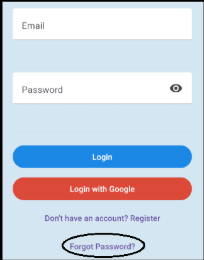

2. **Ingreso del Correo Electrónico Vinculado**:  
   - Ingresa la dirección de correo electrónico vinculada a tu cuenta. Asegúrate de que sea el mismo correo que utilizaste al registrarte.
   -
    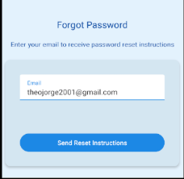

3. **Recepción del Correo de Recuperación**:  
   - Revisa tu bandeja de entrada (o carpeta de spam, en caso de que no lo encuentres) para localizar el correo que contiene el enlace de recuperación.  

        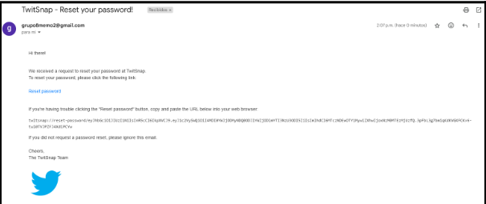

4. **Uso del Enlace de Recuperación**:  
   - Copia el enlace proporcionado en el correo y pégalo en el navegador Google Chrome (u otro navegador de tu preferencia).  
  
    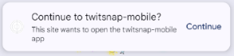

5. **Restablecimiento de Contraseña**:  
   - Sigue las instrucciones para establecer una nueva contraseña. Asegúrate de elegir una contraseña segura que sea fácil de recordar para ti.

        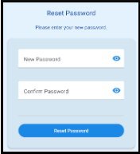

6. **Inicio de Sesión con la Nueva Contraseña**:  
   - Una vez que hayas creado tu nueva contraseña, regresa a la aplicación e inicia sesión con tus credenciales actualizadas.

Recuerda que este proceso está diseñado para garantizar la seguridad de tu cuenta. Si encuentras algún problema durante el proceso, contacta al soporte técnico de la aplicación.
